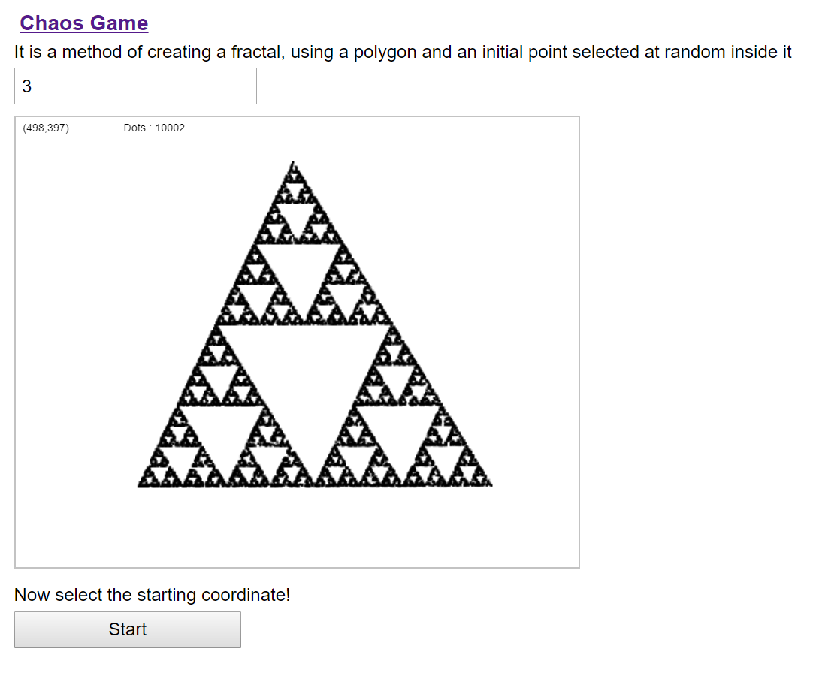

## Description

[Chaos Game](https://en.wikipedia.org/wiki/Chaos_game) is a method of creating a fractal, using a polygon and an initial point selected at random inside it.  This implementation is inspired from a [Computerphile's video](https://www.youtube.com/watch?v=kbKtFN71Lfs&ab_channel=Numberphile).

